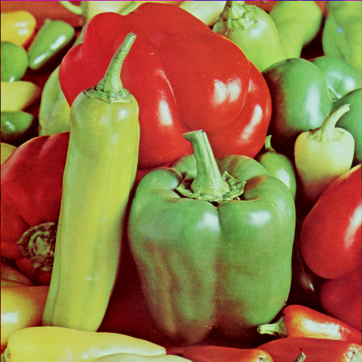

# fastblur
Blur images quickly.

Uses a recursive moving average filter applied multiple times to approximate gaussian blur.
As opposed to convolution-based blur filters, fastblur is just as fast for any blur size.
Fastblur converts the image to a linear color space before blurring, which gives natural
looking blur.

## Example output

*The peppers test image*

*The peppers test image, blurred using fastblur.*
`fastblur -p 4 -z 49 peppers.png peppers_blurred.png`
